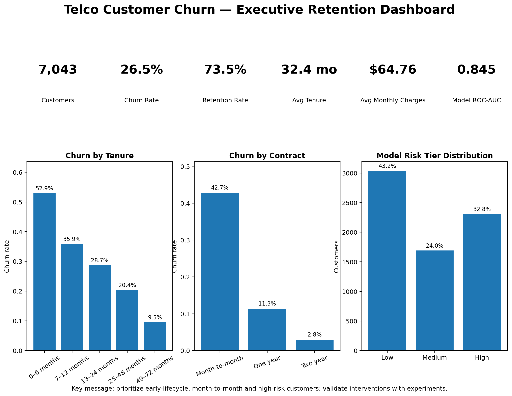

# 📊 Telco Customer Churn Analysis & Prediction

> End-to-end customer churn analytics project using Python, statistical testing, lifecycle segmentation, logistic regression, risk scoring, and retention strategy.



## 🎯 Business Objective

Customer churn reduces recurring revenue and customer lifetime value. This project identifies high-churn lifecycle and subscription segments, tests statistical associations, builds an interpretable churn-risk model, and translates the evidence into retention actions.

## 📌 Executive Results

| KPI | Result |
|---|---:|
| Total customers | **7,043** |
| Churned customers | **1,869** |
| Retained customers | **5,174** |
| Overall churn rate | **26.5%** |
| Overall retention rate | **73.5%** |
| Average tenure | **32.4 months** |
| Average monthly charges | **$64.76** |
| Monthly charges associated with churned customers | **$139,130.85** |
| Logistic regression ROC-AUC | **0.845** |
| Logistic regression recall | **0.805** |

## 🔎 Key Findings

### Lifecycle / tenure

| Tenure band | Churn rate |
|---|---:|
| 0–6 months | **52.9%** |
| 7–12 months | **35.9%** |
| 13–24 months | **28.7%** |
| 25–48 months | **20.4%** |
| 49–72 months | **9.5%** |

The strongest observed churn concentration is in the early customer lifecycle.

### Contract

| Contract | Churn rate |
|---|---:|
| Month-to-month | **42.7%** |
| One year | **11.3%** |
| Two year | **2.8%** |

Contract type is strongly associated with churn in the supplied dataset. These results are associations, not proof that contract type itself causes churn.

## 🧪 Statistical Testing

- **Chi-square tests** evaluate association between churn and categorical variables.
- **Welch's t-tests** compare churned vs retained customers for tenure, monthly charges and total charges.
- **Benjamini–Hochberg FDR correction** is included for the multiple categorical tests to reduce false-discovery risk.

## 🤖 Churn Prediction

An interpretable **Logistic Regression** pipeline is used with imputation, scaling and one-hot encoding.

| Metric | Result |
|---|---:|
| Accuracy | **73.9%** |
| Precision | **50.5%** |
| Recall | **80.5%** |
| F1 | **62.1%** |
| ROC-AUC | **84.5%** |

The model is evaluated on a stratified 20% holdout set. After evaluation, the final pipeline is refit on all available historical records before producing the portfolio risk scores.

### Risk scoring

Customers receive a probability-based churn score and three operational tiers: **Low (≤30%)**, **Medium (>30% to 60%)**, and **High (>60%)**. Thresholds are business-oriented and should be tuned using intervention capacity and validation data in a real deployment.

## 💰 Revenue Exposure

The project reports **$139,130.85 in monthly charges associated with customers who historically churned**. This is historical revenue exposure, not forecasted future revenue loss. For a true forward-looking at-risk revenue measure, score only active customers and aggregate the monthly charges of high-risk accounts.

## 💡 Retention Strategy

1. Strengthen onboarding and activation during the first 6–12 months.
2. Prioritize high-risk/high-value active customers for retention outreach.
3. Test appropriate month-to-month → longer-contract conversion offers.
4. Investigate support/service gaps in high-churn segments.
5. Capture explicit cancellation reasons and exit-survey feedback.
6. Add product usage, engagement, support, payment and acquisition data.
7. Measure retention interventions with controlled experiments rather than assuming association implies causation.

## ⚠️ Data Limitations

The supplied dataset has no signup date, region, explicit churn reason, product usage or customer engagement history. Therefore:

- tenure bands are used as **lifecycle cohorts**, not true calendar-month cohorts;
- actual stated churn reasons cannot be inferred;
- regional analysis is unavailable; and
- the risk model should be validated on current/future business data before operational use.

## 🗂️ Repository Structure

```text
telco-customer-churn-analysis/
├── data/
│   ├── README.md
│   └── WA_Fn-UseC_-Telco-Customer-Churn.csv
├── notebooks/
│   └── Telco_Customer_Churn_End_to_End_Project.ipynb
├── src/
│   └── telco_customer_churn_analysis.py
├── outputs/
│   ├── executive_dashboard.png
│   ├── charts/
│   └── tables/
├── README.md
├── requirements.txt
├── project_report.md
├── presentation_outline.md
├── GITHUB_UPLOAD_GUIDE.md
├── LICENSE
└── .gitignore
```

## 🛠️ Technologies

Python · Pandas · NumPy · Matplotlib · SciPy · Scikit-learn · Jupyter Notebook · Logistic Regression · Statistical Testing

## ▶️ Run Locally

```bash
pip install -r requirements.txt
python src/telco_customer_churn_analysis.py
```

The script is path-safe and can be executed from the project root. It was tested successfully against the included dataset and writes charts and tables to `outputs/`.

To explore the work interactively, open `notebooks/Telco_Customer_Churn_End_to_End_Project.ipynb`.

## ⭐ Future Improvements

- SHAP explainability
- Survival analysis
- True calendar-month cohort retention
- Formal Customer Lifetime Value modeling
- Churn-reason classification after collecting reason data
- Power BI dashboard
- API deployment and automated scoring
- Retention A/B testing

## 📌 Portfolio Note

This is an educational/internship analytics project. Statistical findings describe associations in the supplied historical dataset; they should be validated against current business data before operational use.
